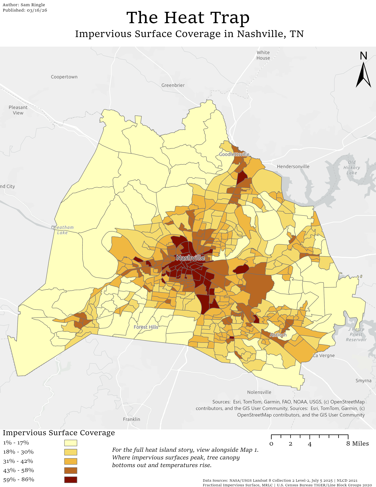

# Nashville Urban Heat Island Analysis

**Author:** Samuel Ringle  
**Tools:** ArcGIS Pro, Microsoft Excel  
**Data Vintage:** 2020–2025  
**Geography:** Davidson County, Tennessee

---

## Project Overview

This project examines the urban heat island effect across Davidson County, Tennessee, analyzing the relationship between land surface temperature and two key contributing variables: tree canopy coverage and impervious surface coverage. The analysis uses census block groups as the unit of analysis to identify which neighborhoods experience the highest surface temperatures and whether those patterns correspond to lower tree canopy or higher concentrations of pavement and built cover.

The analysis produces two publication quality maps. The first pairs mean land surface temperature with tree canopy coverage to explore the cooling effect of urban vegetation. The second pairs mean land surface temperature with impervious surface coverage to explore how pavement and built surfaces contribute to localized heat. The two maps are designed to be read together as a complete picture of what drives surface temperature variation across Davidson County.

---

## Methodology

Census block groups were used as the unit of analysis. Land surface temperature was derived from Landsat 8 satellite imagery captured on July 5 2025, a peak summer date selected to maximize the heat island signal. Tree canopy data was sourced from a Nashville specific urban tree canopy dataset. Impervious surface data was sourced from the NLCD 2021 Fractional Impervious Surface product.

**Study area and coordinate system**

Davidson County block groups were isolated from the statewide Tennessee TIGER/Line shapefile using Select by Attribute on the county FIPS field (COUNTYFP = 037). All layers were reprojected to WGS 1984 UTM Zone 16N before analysis to ensure consistent linear units across all operations and accurate area calculations in square meters. The clipped LST raster was further masked to the Davidson County boundary using Extract by Mask to limit the temperature surface to the study area.

**Land surface temperature conversion**

The Landsat 8 Collection 2 Level-2 Surface Temperature band (ST_B10) stores raw scaled integer values that require conversion before they carry physical meaning. Using scale factors and additive offsets from the accompanying MTL.txt metadata file, pixel values were converted to Fahrenheit using the following Raster Calculator expression:

```
(ST_B10 * 0.00341802 + 149.0 - 273.15) * 9/5 + 32
```

This converts raw values to Kelvin using the USGS specified scale factor and offset, subtracts 273.15 to convert to Celsius, then applies the standard conversion to Fahrenheit. The resulting raster represents actual land surface temperature at 30-meter resolution across Davidson County.

It is worth noting that land surface temperature differs significantly from air temperature. Dark impervious surfaces like asphalt and rooftops absorb and re-radiate heat far more intensely than the air above them, which is why peak pixel values can exceed 160 degrees Fahrenheit on a July afternoon even when ambient temperatures are in the 90s. This distinction is important context for interpreting the maps.

**Mean temperature per block group**

Zonal Statistics as Table was run with Davidson County block groups as the zone layer and the clipped Fahrenheit raster as the value layer. GEOID was used as the zone field to uniquely identify each block group and enable joining back to the spatial layer. The tool calculated mean land surface temperature per block group, representing the average pixel temperature across the entire polygon area.

Mean was chosen over maximum to produce a neighborhood-level summary that reflects overall thermal conditions rather than single-pixel hotspots. A single dark rooftop can push the maximum value for an entire block group, which makes maximums less representative of conditions across the neighborhood as a whole.

**Tree canopy coverage per block group**

The Nashville Urban Tree Canopy 2021 dataset was delivered as a polygon shapefile representing discrete canopy areas across the city. Because the Tabulate Intersection tool requires an Advanced license and Polygon to Raster encountered environment issues in this project, canopy coverage was calculated through a vector based approach that is actually more precise than a rasterized alternative would have been.

The Intersect tool was used to cut tree canopy polygons to block group boundaries, producing fragments representing the portion of each canopy polygon falling within each block group. A Shape.Area field was calculated on the resulting layer to capture each fragment's area in square meters, consistent with the UTM Zone 16N projection. Summary Statistics then summed canopy area by GEOID, and the results were joined back to the block group layer. A Canopy_Pct field was calculated by dividing total canopy area within each block group by the block group's total area and multiplying by 100.

This approach produces a true canopy coverage percentage derived directly from polygon geometry rather than from a rasterized estimate. Because the calculation works with the source polygons at their native precision, it captures canopy extent more accurately than a 30 meter raster conversion would at this scale.

**Impervious surface coverage per block group**

The NLCD 2021 Fractional Impervious Surface raster stores impervious cover as a percentage value per pixel, ranging from 0 to 100. Each 30 meter pixel already represents the percentage of that cell covered by impervious surface, making the data immediately interpretable without further transformation. Zonal Statistics as Table was run using the block group layer as the zone and the NLCD raster as the value, producing a mean impervious surface percentage per block group. That mean represents the average impervious cover across all 30 meter pixels within each block group boundary.

**Final dataset**

All three derived variables, mean surface temperature, canopy coverage percentage, and mean impervious surface percentage, were joined to the block group layer and exported as a clean permanent feature class for cartographic production. Duplicate fields introduced through sequential joins were removed before export.

---

## Maps

[View the full interactive StoryMap on ArcGIS Online  →](https://arcg.is/1uG9nq1)

**Map 1 — The Cooling Effect: Tree Canopy Coverage and Surface Temperature**  

Block groups with lower tree canopy coverage cluster in the urban core of Nashville and show consistently higher mean surface temperatures than block groups with greater canopy coverage on the periphery. The pattern reflects the well documented cooling effect of urban vegetation. Trees reduce surface temperatures through shading and evapotranspiration, both of which are largely absent in densely built areas with little green space. The Cumberland River corridor and surrounding greenways are visible as a thermal break running through the urban core, reinforcing the role of vegetation and open water in moderating surface heat.  


[View Interactive Map →](https://arcg.is/1jDD994)

---

**Map 2 — The Heat Trap: Impervious Surface Coverage and Urban Heat**
*This map is intended to be viewed alongside Map 1. Where impervious surfaces peak, tree canopy bottoms out and temperatures follow.*  

High impervious surface coverage is tightly concentrated in downtown Nashville and its surrounding commercial and industrial corridors, corresponding directly to the hottest block groups in the dataset. Block groups with lower impervious surface coverage, particularly those with significant tree canopy, green space, or lower-density residential development, show markedly lower mean surface temperatures.



[View Interactive Map →](https://arcg.is/0GDjyf)  

Together the two maps tell a consistent and complementary story. The urban heat island in Nashville is most intense where tree canopy is sparse and impervious surfaces dominate, and least intense in vegetated peripheral areas. These findings have direct implications for urban planning. Block groups that score poorly on both canopy coverage and surface temperature represent priority areas for green infrastructure investment, including tree planting programs, green roofs, cool pavement initiatives, and urban park expansion.

---

## Data Sources

| Dataset | Source | Vintage |
|---|---|---|
| Land Surface Temperature (ST_B10) | NASA/USGS Landsat 8 Collection 2 Level-2, USGS EarthExplorer | July 5, 2025 |
| Urban Tree Canopy | Nashville Urban Tree Canopy 2021, data.nashville.gov | 2021 |
| Impervious Surface | NLCD 2021 Fractional Impervious Surface, Multi-Resolution Land Characteristics Consortium (MRLC) | 2021 |
| Census Block Groups | U.S. Census Bureau, TIGER/Line Shapefiles | 2020 |

---

## Limitations

**Mean temperature as a summary statistic:** Zonal means smooth out within-block-group variation. A block group containing both a parking lot and a park will average their temperatures together, which can mask localized hotspots. This is a known tradeoff of using administrative boundaries as the unit of analysis.

**Single-date imagery:** Land surface temperature was derived from a single Landsat scene captured on July 5, 2025. A single date captures conditions on that specific day and may be influenced by recent precipitation, atmospheric moisture, or other conditions not fully corrected by Level-2 processing. A multi-date composite would produce more robust temperature estimates but was outside the scope of this project.

**Tree canopy as presence, not quality:** The Nashville Urban Tree Canopy dataset captures canopy coverage area but does not distinguish between mature canopy and recently planted or low-density canopy. Coverage percentage captures extent but not the depth of cooling benefit a given canopy provides.

**Impervious surface from NLCD:** The NLCD impervious surface product is derived from national-scale modeling at 30-meter resolution. Local variation in pavement type, surface albedo, and material composition is not captured at this resolution and may affect temperature outcomes in ways not reflected in the block group means.

**Block group boundaries:** Block groups are administrative units designed for Census data collection and do not correspond to neighborhood boundaries, planning districts, or natural geographic features. Residents near block group boundaries may experience conditions more consistent with an adjacent block group than their own.
